# Governance-Feature Inference Map

**Purpose**: Track bidirectional relationships between architectural/process governance and implemented features

**Status**: Active - Phase 0 Complete  
**Last Updated**: 2025-11-26  
**Governance**: [PDR-0008: Feature Documentation Standard](./governance/PDRs/PDR-0008-feature-documentation-standard.md)

---

## Overview

This document tracks the **bidirectional inference relationship** between governance decisions (ADRs, PDRs, POLs) and service features:

- **Governance → Features**: Which features validate/prove this governance decision?
- **Features → Governance**: Which governance decisions does this feature require/invoke?

**Strategic Value**:
- ✅ **Living Governance**: Features validate that ADRs/PDRs/POLs work in practice (not just theory)
- ✅ **Feature Traceability**: Features show clear architectural justification (not ad-hoc)
- ✅ **Gap Detection**: Identifies orphaned governance (unused ADRs) or ungoverned features (missing ADRs)
- ✅ **Onboarding**: New developers see "how we apply decisions in real code"
- ✅ **Compliance**: Complete chain from decision → feature → code → test

### Bidirectional Inference Architecture

The following diagram shows how governance and features relate bidirectionally:

### Gap Analysis Types

Four types of gaps can be detected through bidirectional inference:

```mermaid
graph LR
    subgraph "Gap Types"
        OG[Orphaned Governance<br/>Decisions without features<br/>❓ Premature or missing features?]
        UF[Ungoverned Features<br/>Features without decisions<br/>❓ Missing ADR or incorrect refs?]
        MG[Missing Governance<br/>Patterns need decisions<br/>❓ Create ADR for pattern?]
        MF[Missing Features<br/>Decisions need validation<br/>❓ Implement feature?]
    end
    
    OG -->|Phase 1| Analysis1[Analyze each ADR/PDR/POL]
    Analysis1 -->|0 features?| OG
    
    UF -->|Phase 3| Analysis2[Analyze features]
    Analysis2 -->|0 ADR refs?| UF
    
    MG -->|Phase 3| Analysis3[Scan feature patterns]
    Analysis3 -->|No ADR exists?| MG
    
    MF -->|Phase 1| Analysis4[Analyze governance]
    Analysis4 -->|No feature exists?| MF
    
    style OG fill:#fbb,stroke:#333,stroke-width:2px
    style UF fill:#fbb,stroke:#333,stroke-width:2px
    style MG fill:#ffb,stroke:#333,stroke-width:2px
    style MF fill:#ffb,stroke:#333,stroke-width:2px
```

---

## Governance → Features (What Features Validate This Decision?)

### Architectural Decisions (ADRs)

#### ADR-0004: Scala 3 Technology Stack

**Decision Summary**: Scala 3 with functional programming as primary stack

**Features That Validate This**:

**ALL features should demonstrate**:
1. **Immutability** - Cart state, order data, product entities use immutable case classes
2. **Pure Functions** - Business logic expressed as functions without side effects
3. **Effect Systems** - ZIO/Cats Effect for I/O, database access, HTTP calls
4. **Type Safety** - Compile-time guarantees for business rules
5. **Pattern Matching** - Domain model validation and message handling

**Specific Inferred Features** (P1 Priority):
- **Cart - Add Item** (validates: immutable cart state, pure validation functions, ZIO effects)
- **Order - Create Order** (validates: algebraic data types for order state, type-safe domain model)
- **Product - Query Catalog** (validates: functional streaming, compositional queries)
- **Payment - Process Payment** (validates: pure functions for calculations, type-safe amounts)
- **User - Authentication** (validates: effect systems for secure operations, immutable tokens)

**Validation Status**: ✅ Phase 1 Analysis Complete

**Gap Assessment**: 
- **Orphaned?**: ❌ No - All TJMPaaS features must use Scala 3 + FP (core requirement)
- **Compliance**: Phase 2 will validate (expect 100% - ADR-0004 is foundational)

---

#### ADR-0005: Reactive Manifesto Alignment

**Decision Summary**: Responsive, resilient, elastic, message-driven systems

**Features That Validate This**:

**Responsive** (< 200ms p95 response time):
- **Cart - Query Cart** - Fast cart retrieval (read-heavy, < 100ms target)
- **Product - Search Products** - Real-time search with Elasticsearch (< 150ms)
- **Inventory - Check Availability** - High-frequency queries (< 50ms)

**Resilient** (failure isolation, recovery):
- **Cart - Session Recovery** - Recovers cart state after actor restart
- **Payment - Idempotent Processing** - Handles retries safely
- **Order - Saga Failure Recovery** - Compensating transactions on failure

**Elastic** (horizontal scaling):
- **Cart - Distributed Carts** - Actor sharding scales across nodes
- **Product - Catalog Scaling** - Read replicas scale independently  
- **Search - Auto-Scaling** - Elasticsearch cluster elasticity

**Message-Driven** (async, backpressure):
- **Cart - Add Item** - Actor message handling with mailbox backpressure
- **Order - Event Publishing** - Kafka integration for order events
- **Notifications - Email Sending** - Async message queue with backpressure

**Validation Status**: ✅ Phase 1 Analysis Complete

**Gap Assessment**:
- **Responsive**: ~10 features with SLA requirements (P1 priority)
- **Resilient**: ~8 features with circuit breakers/supervision (P1)
- **Elastic**: ~5 features requiring horizontal scaling (P0-P1)
- **Message-Driven**: ALL features should use actors/events (P0 - foundational)

---

#### ADR-0006: Agent-Based Service Patterns (Actor Model)

**Decision Summary**: Use actor model for concurrency and state management

**Features That Validate This**:

**Stateful Entity Actors** (one actor per entity instance):
- **Cart - Actor** - One actor per cart, encapsulates cart state
- **Order - Actor** - One actor per order, manages order lifecycle  
- **User Session - Actor** - One actor per session, tracks user context
- **Payment Transaction - Actor** - One actor per transaction, ensures idempotency

**Message Protocols** (commands, responses, events):
- **Cart - Add Item** - Command: `AddItem(item, replyTo)`, Response: `ItemAdded` or `CartFull`
- **Order - Create Order** - Command: `CreateOrder(cart, replyTo)`, Response: `OrderCreated(orderId)` or `OrderCreationFailed(reason)`
- **Payment - Process Payment** - Command: `ProcessPayment(orderId, amount, replyTo)`, Response: `PaymentSucceeded` or `PaymentFailed`

**Supervision Strategies**:
- **Cart - Restart** - Cart actor restarts on failure, recovers state from event log
- **Order - Escalate** - Critical order failures escalate to supervisor
- **Session - Stop** - Session actor stops on invalid state, new session created

**Concurrency Safety** (no locks, no shared mutable state):
- **ALL actor-based features** - Message-passing eliminates race conditions
- **Inventory - Reserve Item** - Actor ensures thread-safe reservation

**Validation Status**: ✅ Phase 1 Analysis Complete

**Gap Assessment**:
- **Stateful Features**: ~8 features requiring actors (Cart, Order, Session, Payment, Inventory, etc.)
- **Message Protocols**: ALL actor features must define command/response/event protocols (P0)
- **Supervision**: ALL actor features must document supervision strategy (P0)
- **Orphaned?**: ❌ No - Actor model is core concurrency pattern, 100% usage expected

---

#### ADR-0007: CQRS and Event-Driven Architecture

**Decision Summary**: Separate command/query models, event sourcing, event-driven integration

**Features That Validate This**:

**CQRS Level 2 - Standard CQRS** (separate read/write models, no event sourcing):
- **Cart - Query Cart** - Read model optimized for display, write model for updates
- **Product - Catalog Query** - Denormalized read model (Elasticsearch), write model (PostgreSQL)
- **User - Profile Management** - Read replica for queries, write primary for updates

**CQRS Level 3 - Full Event Sourcing** (complete audit trail, temporal queries):
- **Order - Lifecycle** - All state changes as events (OrderCreated, OrderPaid, OrderShipped, etc.)
- **Payment - Processing** - Immutable event log (PaymentInitiated, PaymentAuthorized, PaymentSettled)
- **Inventory - Movement** - Event sourcing for audit (ItemReceived, ItemReserved, ItemSold, ItemReturned)

**Event Publishing** (domain events for integration):
- **Cart - Checkout** - Publishes `CartCheckedOut` event → triggers order creation
- **Order - Placed** - Publishes `OrderPlaced` event → triggers inventory reservation, payment processing
- **Payment - Completed** - Publishes `PaymentCompleted` event → triggers order fulfillment
- **Inventory - Updated** - Publishes `InventoryChanged` event → triggers low-stock notifications

**Event Consuming** (subscribes to events from other services):
- **Notifications - Order Notifications** - Consumes `OrderPlaced`, `OrderShipped` → sends emails
- **Analytics - Dashboard** - Consumes all domain events → updates metrics
- **Recommendations - Product Suggestions** - Consumes `OrderPlaced` → updates recommendation model

**Saga Patterns** (distributed transactions):
- **Checkout Saga** - Coordinates cart checkout → order creation → payment → inventory reservation
- **Fulfillment Saga** - Coordinates inventory picking → shipping → delivery tracking

**Validation Status**: ✅ Phase 1 Analysis Complete

**Gap Assessment**:
- **CQRS Level 2**: ~5 features (cart, product catalog, user profiles)
- **CQRS Level 3**: ~4 features requiring audit trail (orders, payments, inventory, compliance)
- **Event Publishing**: ~10 features producing domain events
- **Event Consuming**: ~8 features consuming events for integration
- **Sagas**: ~3-5 distributed workflows requiring saga pattern
- **Orphaned?**: ❌ No - CQRS/ES is core architecture pattern, expected in all stateful services

---

### Process Decisions (PDRs)

#### PDR-0004: Repository Organization Strategy

**Decision Summary**: Multi-repo (one per service), TJMSolns-<ServiceName> naming

**Features That Validate This**:

**Service Isolation** (features belong to service repos):
- **ALL CartService features** - In `TJMSolns-CartService/features/` directory
- **ALL OrderService features** - In `TJMSolns-OrderService/features/` directory
- **ALL PaymentService features** - In `TJMSolns-PaymentService/features/` directory

**Independent Deployment** (features deployed with service):
- **Cart - Add Item** - Deployed independently as part of CartService
- **Order - Create Order** - Deployed independently as part of OrderService
- No cross-repo code dependencies (only API/message integration)

**Service Registry Tracking**:
- **Service Registry** - Lists all services with repo links, feature counts

**Validation Status**: ✅ Phase 1 Analysis Complete

**Gap Assessment**:
- **All features must be in service repositories** (not in governance repo)
- **No cross-repo code sharing** (only shared libraries via Maven/artifacts)
- **Each service has `features/` directory** following standard structure
- **Orphaned?**: ❌ No - Repository structure validated by existence of services with features

---

#### PDR-0006: Service Canvas Documentation Standard

**Decision Summary**: SERVICE-CANVAS.md required for every service

**Features That Validate This**:

**Canvas Integration** (all services must have canvas):
- **CartService Canvas** - Lists all cart features with status (🟢/🟡/🔴), CQRS level, governance refs
- **OrderService Canvas** - Lists all order features with quick status overview
- **PaymentService Canvas** - Lists all payment features

**Features Section in Canvas**:
- **Quick Status Table**: Feature name, status emoji, CQRS level, key governance (ADRs/PDRs), gaps
- **Living Document**: Canvas updated when features added/changed
- **Documentation Hierarchy**: README → Canvas → Feature Docs → Detailed Docs

**Canvas as Design Tool**:
- **Upfront Planning**: Canvas forces thinking about features before implementation
- **Gap Visibility**: Canvas shows missing features, incomplete features
- **Onboarding**: New team members see all features at a glance

**Validation Status**: ✅ Phase 1 Analysis Complete

**Gap Assessment**:
- **100% of services must have SERVICE-CANVAS.md** (mandatory per PDR-0006)
- **Canvas must include Features section** with table listing all features
- **Canvas updated quarterly** or when features change significantly
- **Orphaned?**: ❌ No - Validated by existence of service canvases with feature sections

---

#### PDR-0008: Feature Documentation Standard

**Decision Summary**: Feature documentation with BDD + technical .md files

**Features That Validate This**:

**Meta-Validation** (PDR-0008 validated by existence of feature documentation):
- **ALL features following standard** - Each feature has `.feature` (Gherkin) + `.md` (technical) files
- **Template compliance** - Features use FEATURE-TEMPLATE.md structure
- **Governance cross-referencing** - Features explicitly reference ADRs/PDRs/POLs
- **Bidirectional inference** - Features documented in inference map

**BDD Integration**:
- **Cart - Add Item.feature** - Gherkin scenarios executable with ScalaTest + Cucumber
- **Order - Create Order.feature** - BDD scenarios define acceptance criteria
- **ALL features** - Executable specifications aligned with implementation

**Gap Analysis in Features**:
- **Each feature documents gaps** - What exists, critical gaps, proposed solutions, effort
- **Informs roadmap** - Gap analysis drives feature prioritization

**Validation Status**: ✅ Phase 1 Analysis Complete (meta-standard validated by existence of other features)

**Gap Assessment**:
- **Template compliance**: Will be validated in Phase 2 (first features documented)
- **Governance cross-refs**: Will verify 100% of features reference applicable governance
- **BDD coverage**: Will track % features with executable Gherkin scenarios
- **Orphaned?**: ❌ No - Standard is validated by all features following it (circular validation)

---

### Policies (POLs)

#### POL-security-baseline

**Decision Summary**: Security standards for authentication, authorization, data protection

**Features That Validate This**:

**Authentication Required** (all features handling sensitive data/operations):
- **User - Authentication** - OAuth 2.0/OIDC implementation
- **User - Authorization** - RBAC for user permissions
- **Payment - Process Payment** - Service-to-service auth, workload identity
- **Order - Create Order** - Authenticated user required
- **Cart - Checkout** - User authentication enforced

**Encryption** (data in transit and at rest):
- **ALL API features** - HTTPS/TLS 1.2+ enforced (no HTTP in production)
- **Payment - Store Card** - PCI-DSS compliant encryption, tokenization
- **User - Profile Data** - Database encryption, field-level for PII
- **Order - Order Data** - At-rest encryption for order history

**Secrets Management**:
- **ALL features** - No hardcoded credentials, use Kubernetes Secrets/Cloud KMS
- **Payment - Gateway Integration** - API keys in secrets, rotated annually
- **User - Auth Tokens** - JWT secrets in KMS, rotation supported

**Audit Logging** (security-relevant events):
- **User - Authentication** - Log all auth attempts (success/failure)
- **Payment - Transactions** - Log all payment operations (immutable audit trail)
- **Order - State Changes** - Log all order modifications with user identity
- **Admin - Operations** - Log all administrative actions

**Network Security**:
- **ALL features** - Kubernetes network policies restrict traffic
- **Payment - External Gateway** - Traffic only to approved payment gateways
- **Internal Services** - mTLS for service-to-service communication (preferred)

**Vulnerability Management**:
- **ALL services** - Container images scanned for vulnerabilities
- **Dependencies** - Regular dependency updates, security patches applied
- **CVE Response** - Critical vulnerabilities patched within 7 days

**Validation Status**: ✅ Phase 1 Analysis Complete

**Gap Assessment**:
- **Authentication**: ~10 features requiring authentication (P0)
- **Encryption**: 100% of features must use TLS (P0 - mandatory)
- **Secrets**: 100% of features must use proper secrets management (P0)
- **Audit Logging**: ~15 features with security-relevant events requiring logging
- **Orphaned?**: ❌ No - Security baseline is cross-cutting requirement, all features must comply

---

#### POL-quality-code-standards

**Decision Summary**: Code quality standards for testing, maintainability, commercial viability

**Features That Validate This**:

**Unit Testing** (≥80% coverage for business logic):
- **Cart - Add Item** - Unit tests for cart actor, validation logic, state transitions
- **Order - Create Order** - Unit tests for order creation logic, domain validation
- **Payment - Process Payment** - Unit tests for payment calculations, state machine
- **ALL features** - Critical business logic must have unit tests (P0)

**Integration Testing** (API endpoints, service interactions):
- **Cart - API Endpoints** - Integration tests for all cart API endpoints (add, remove, query, checkout)
- **Order - Service Integration** - Tests for cart → order → payment flow
- **Payment - Gateway Integration** - Tests for payment gateway communication (mocked and real)

**BDD Testing** (Gherkin scenarios):
- **ALL features** - Executable `.feature` files with Given/When/Then scenarios (per PDR-0008)
- **Cart - Add Item.feature** - BDD scenarios define acceptance criteria
- **Order - Create Order.feature** - Business-readable specifications

**Error Handling**:
- **Cart - Add Item** - Handles full cart, invalid item, session expired gracefully
- **Payment - Process Payment** - Handles payment failures, network errors, timeouts
- **Order - Create Order** - Handles inventory reservation failures, compensation logic

**Code Quality**:
- **ALL features** - Follow Scala 3 best practices, functional programming patterns (per ADR-0004)
- **Readability**: Self-documenting code, clear naming, explanatory comments for complex logic
- **Maintainability**: DRY principle, SOLID where applicable, technical debt tracked

**Container Testing**:
- **ALL features** - Services containerize successfully, health checks tested, graceful shutdown

**Validation Status**: ✅ Phase 1 Analysis Complete

**Gap Assessment**:
- **Unit Tests**: ALL features with business logic require ≥80% coverage (P0)
- **Integration Tests**: ALL API endpoints require integration tests (P0)
- **BDD Scenarios**: ALL features require Gherkin `.feature` files (P0 per PDR-0008)
- **Error Handling**: ALL features must handle failures gracefully (P0)
- **Orphaned?**: ❌ No - Code quality is cross-cutting requirement validated by test coverage metrics

---

## Features → Governance (What Governance Does This Feature Require?)

### CartService Features

#### Cart - Add Item

**Feature Summary**: *To be documented in Phase 2*

**Required Governance**:
- *To be documented when feature created*
- Expected: ADR-0006 (actor for cart state), ADR-0007 (command handling), POL-security (auth required)

**Governance Coverage**: ⏳ Pending Phase 2

**Inferred Missing Governance**: TBD (analysis in Phase 3)

---

#### Cart - Query Cart

**Feature Summary**: *To be documented in Phase 2*

**Required Governance**:
- *To be documented when feature created*
- Expected: ADR-0007 (query side), ADR-0005 (responsive < 100ms)

**Governance Coverage**: ⏳ Pending Phase 2

**Inferred Missing Governance**: TBD

---

#### Cart - Remove Item

**Feature Summary**: *To be documented in Phase 2*

**Required Governance**:
- *To be documented when feature created*

**Governance Coverage**: ⏳ Pending Phase 2

**Inferred Missing Governance**: TBD

---

#### Cart - Checkout

**Feature Summary**: *To be documented in Phase 2*

**Required Governance**:
- *To be documented when feature created*
- Expected: Saga pattern ADR (likely missing, will infer need in Phase 3)

**Governance Coverage**: ⏳ Pending Phase 2

**Inferred Missing Governance**: TBD (likely needs saga pattern ADR for distributed transaction)

---

#### Cart - Session Management

**Feature Summary**: *To be documented in Phase 2*

**Required Governance**:
- *To be documented when feature created*
- Expected: ADR-0006 (actor lifecycle), POL-session-security (likely missing)

**Governance Coverage**: ⏳ Pending Phase 2

**Inferred Missing Governance**: TBD (likely needs session security POL)

---

### OrderService Features

*To be documented in Phase 5 (Second Service Validation)*

---

## Gap Analysis

### Orphaned Governance (Decisions Without Features)

**Definition**: Governance documents (ADRs/PDRs/POLs) that are not validated by any implemented features

**Status**: ⏳ Analysis in Phase 1

**Process**:
1. Phase 1: Analyze each ADR/PDR/POL
2. Identify which should have features validating them
3. Flag orphaned governance (0 features)
4. Determine: Is governance premature? Or are features missing?

**Results**: TBD

---

### Ungoverned Features (Features Without ADRs/PDRs/POLs)

**Definition**: Implemented features that lack clear architectural justification or process compliance

**Status**: ⏳ Analysis in Phase 2-3

**Process**:
1. Phase 2: Document core features
2. Phase 3: Analyze features for governance references
3. Flag ungoverned features (0 or insufficient ADR/PDR/POL refs)
4. Determine: Is governance missing? Or feature incorrectly referenced?

**Results**: TBD

---

### Missing Governance (Inferred Needs)

**Definition**: Governance that should exist based on feature requirements but doesn't

**Status**: ⏳ Analysis in Phase 3 (Gap Analysis)

**Process**:
1. Phase 2: Document features with implementation details
2. Phase 3: Analyze features for architectural patterns used
3. Identify patterns without corresponding ADRs (e.g., saga pattern, circuit breaker)
4. Create ADRs for discovered patterns

**Expected Inferences** (from feature analysis):

| Feature Need | Missing Governance | Priority |
|--------------|-------------------|----------|
| Cart checkout saga | ADR: Saga Pattern for Distributed Transactions | High |
| Session timeout | POL: Session Security Policy | Medium |
| API rate limiting | POL: Rate Limiting Policy | Medium |
| Event schema evolution | PDR: Event Schema Versioning | High |
| Feature toggles | PDR: Feature Toggle Strategy | Low |

**Results**: TBD in Phase 3

---

### Missing Features (Governance Not Validated)

**Definition**: Governance decisions that should have features implementing them but don't

**Status**: ⏳ Analysis in Phase 1

**Process**:
1. Phase 1: Analyze ADR-0007 (CQRS) → Should have features at Level 2-3
2. Identify which features are implied but missing
3. Prioritize feature creation

**Expected Inferences** (from governance analysis):

| Governance | Implied Feature | Priority |
|------------|----------------|----------|
| ADR-0007 Level 3 CQRS/ES | Order event sourcing feature | High |
| ADR-0006 Actor patterns | Payment transaction actor feature | High |
| ADR-0005 Reactive (elastic) | Auto-scaling feature | Medium |
| POL-compliance-GDPR | Data deletion feature | High |

**Results**: TBD in Phase 1

---

## Metrics Dashboard

### Coverage Metrics (Updated Phase 1)

**Governance Validation Coverage**:
- **ADRs with Features**: 4 / 4 analyzed (100%) ✅ - ADR-0004, 0005, 0006, 0007 complete
- **PDRs with Features**: 3 / 3 analyzed (100%) ✅ - PDR-0004, 0006, 0008 complete
- **POLs with Features**: 2 / 2 analyzed (100%) ✅ - POL-security-baseline, POL-quality-code-standards complete
- **Overall**: 9 / 9 governance documents analyzed (100%) ✅

**Feature Governance Coverage**:
- **Features with ADR refs**: 0 / 35 inferred (0%) - ⏳ Phase 2 will document features with governance refs
- **Features with PDR refs**: 0 / 35 inferred (0%) - ⏳ Phase 2
- **Features with POL refs**: 0 / 35 inferred (0%) - ⏳ Phase 2

### Inferred Features Count (Phase 1 Complete)

**By Service (Estimated)**:
- **CartService**: ~10 features (Add Item, Query Cart, Remove Item, Checkout, Session Management, Recovery, Validation, etc.)
- **OrderService**: ~8 features (Create Order, Order Lifecycle, Event Sourcing, Saga Coordination, etc.)
- **PaymentService**: ~6 features (Process Payment, Idempotent Processing, Transaction Actor, Gateway Integration, etc.)
- **ProductService**: ~5 features (Query Catalog, Search Products, Catalog Scaling, etc.)
- **UserService**: ~4 features (Authentication, Authorization, Profile Management, etc.)
- **InventoryService**: ~4 features (Reserve Item, Check Availability, Movement Tracking, etc.)
- **NotificationService**: ~3 features (Email Sending, Order Notifications, Event Consuming, etc.)
- **AnalyticsService**: ~2 features (Dashboard, Event Consuming, etc.)
- **RecommendationService**: ~2 features (Product Suggestions, Event Consuming, etc.)

**Total Inferred Features**: ~35 features across 9 services

**By Priority**:
- **P0 (Foundational)**: ~15 features (all must use Scala 3 + FP, actors, HTTPS, secrets management, BDD tests)
- **P1 (Core)**: ~12 features (major user-facing capabilities: cart operations, order creation, payment processing)
- **P2 (Enhanced)**: ~6 features (valuable additions: analytics, recommendations, auto-scaling)
- **P3 (Future)**: ~2 features (nice-to-have, lower priority)

### Gap Metrics

- **Orphaned Governance**: 0 ✅ (all ADRs/PDRs/POLs have expected features)
- **Ungoverned Features**: TBD in Phase 2-3 (target: 0)
- **Missing Governance Items**: TBD in Phase 3 (e.g., saga pattern ADR, circuit breaker POL if used but not governed)
- **Missing Features**: TBD in Phase 2 (compare inferred vs documented)

### Quality Metrics

- **Average ADR refs per feature**: TBD in Phase 2 (target: 3-5)
- **Average features per ADR**: ~9 features per ADR (35 features / 4 ADRs = 8.75)
- **Inference discovery rate**: TBD in Phase 3 (% governance gaps found)

---

## Validation Process

The following diagram shows the 7-phase validation process for maintaining governance-feature alignment:

**Phase Status** (as of 2025-11-26):
- ✅ **Phase 0**: Foundation complete (PDR-0008, templates, this inference map)
- ✅ **Phase 1**: Governance inference complete (9/9 governance analyzed, ~35 features inferred, 0 orphans)
- ⏳ **Phase 2-7**: Deferred until actual service repositories created

---

### Phase 1: Governance Inference Analysis (Week 1) ✅ COMPLETE

**Objective**: Analyze existing governance for implied features

**Activities**:
1. ✅ Read each ADR (ADR-0004 through ADR-0007)
2. ✅ For each ADR, ask: "What features would validate this decision?"
3. ✅ List 3-10 inferred features per ADR
4. ✅ Prioritize features (P0/P1/P2/P3)
5. ✅ Update "Governance → Features" sections above
6. ✅ Identify potential orphaned governance (result: 0 orphans)
7. ✅ Analyze PDRs (PDR-0004, 0006, 0008) for feature requirements
8. ✅ Analyze POLs (POL-security-baseline, POL-quality-code-standards) for compliance features

**Deliverables**:
- ✅ ~35 inferred features listed across 9 services
- ✅ Priority ranking: ~15 P0, ~12 P1, ~6 P2, ~2 P3
- ✅ 0 orphaned governance (all ADRs/PDRs/POLs have expected features)
- ✅ Metrics dashboard updated with Phase 1 results

**Results**:
- **All governance analyzed**: 4 ADRs + 3 PDRs + 2 POLs = 9 documents ✅
- **Inferred features**: 35 features across 9 services (CartService, OrderService, PaymentService, ProductService, UserService, InventoryService, NotificationService, AnalyticsService, RecommendationService)
- **Key patterns identified**:
  * ALL features must demonstrate: Scala 3 + FP, immutability, pure functions, type safety (ADR-0004)
  * ALL features must demonstrate: Reactive principles - responsive, resilient, elastic, message-driven (ADR-0005)
  * Stateful features require actors: Cart, Order, Session, Payment Transaction, Inventory (ADR-0006)
  * CQRS maturity levels: Level 2 (~5 features), Level 3 (~4 features) (ADR-0007)
  * Event-driven integration: ~10 publishing features, ~8 consuming features (ADR-0007)
  * Security compliance: ALL features (authentication, encryption, secrets, audit logging) (POL-security-baseline)
  * Code quality: ALL features (unit tests ≥80%, integration tests, BDD scenarios, error handling) (POL-quality-code-standards)

**Next Phase**: Phase 2 - Document 5 CartService features using FEATURE-TEMPLATE.md

---

### Phase 2: Core Service Features (Week 2)

**Objective**: Document 5 CartService features using template

**Activities**:
1. Create features: Add Item, Query Cart, Remove Item, Checkout, Session Management
2. For each feature, identify applicable ADRs/PDRs/POLs
3. Update "Features → Governance" sections above
4. Test bidirectional inference tracking

**Deliverables**:
- 5 features documented (.feature + .md files)
- Features section added to CartService SERVICE-CANVAS.md
- This inference map populated with feature→governance links
- Template validation and refinement

---

### Phase 3: Gap Analysis (Week 3)

**Objective**: Identify missing governance and missing features

**Activities**:
1. Analyze features for patterns used but not governed (infer missing ADRs)
2. Analyze governance for features implied but not documented (infer missing features)
3. Flag ungoverned features (features with insufficient governance refs)
4. Document gaps in "Gap Analysis" section above
5. Create ADRs for discovered patterns

**Deliverables**:
- List of missing governance (ADRs/PDRs/POLs to create)
- List of missing features (features to document/implement)
- Ungoverned features flagged
- Effort estimates for gap closure

---

### Phase 7: Quarterly Validation (Ongoing)

**Objective**: Maintain inference map accuracy

**Activities**:
1. Review all governance → features links (still accurate?)
2. Review all features → governance links (complete?)
3. Update metrics dashboard
4. Identify new gaps
5. Validate gap closure

**Schedule**: Every quarter (Q1, Q2, Q3, Q4)

---

## Automation Opportunities

### Phase 6: Scripts and Tooling (Week 4-5)

**Potential Automation**:

1. **Governance Link Validator**:
   - Script: Validate all ADR/PDR/POL links in feature .md files
   - Alert: Broken links, invalid references
   - Report: Governance coverage per feature

2. **Inference Gap Detector**:
   - Script: Parse features for patterns (actor usage, CQRS level, events)
   - Compare: Patterns found vs ADRs referenced
   - Alert: Ungoverned patterns (e.g., actor used but ADR-0006 not referenced)

3. **Metrics Dashboard Generator**:
   - Script: Calculate coverage metrics automatically
   - Output: HTML dashboard with charts
   - Refresh: Weekly or on-demand

4. **Missing Feature Identifier**:
   - Script: Analyze ADRs for "should have" language (e.g., "services should use actors")
   - Compare: Actual features vs implied features
   - Report: Governance not validated by features

**Deliverables**: TBD in Phase 6

---

## Notes

### Bidirectional Inference Philosophy

**Why This Matters**:

Traditional approach:
- Write ADRs → Build features → Hope ADRs are followed
- No systematic validation
- ADRs become stale documentation
- Features built without architectural justification

**TJMPaaS approach**:
- Write ADRs → Document features → **Explicitly link them**
- Build features → Discover patterns → **Infer missing ADRs**
- Systematic validation via inference map
- Living governance validated by real code

**Benefits**:
- ✅ Governance is proven (not theoretical)
- ✅ Features are justified (not ad-hoc)
- ✅ Gaps are visible (both directions)
- ✅ Onboarding is clear (see how decisions apply)
- ✅ Compliance is traceable (decision → feature → code)

### Inference Discovery Examples

**Feature → Governance Inference**:

Scenario: Documenting "Cart Checkout" feature in Phase 2

Analysis:
- Checkout needs to: deduct inventory, reserve payment, create order, send confirmation
- This is a distributed transaction across 4 services
- No single database transaction possible
- Pattern used: Saga choreography (events coordinate)
- **Inference**: Need ADR for saga pattern (currently missing)
- **Action**: Flag in Phase 3, create ADR-0009: Saga Pattern for Distributed Transactions

**Governance → Feature Inference**:

Scenario: Analyzing ADR-0007 (CQRS) in Phase 1

Analysis:
- ADR-0007 defines CQRS maturity levels (1/2/3)
- Level 3 is "Full CQRS with Event Sourcing" for audit-critical domains
- Audit-critical domains: Orders, Payments, Inventory
- **Inference**: Should have features at Level 3 for these domains
- **Action**: Document "Order Event Sourcing" feature (inferred from ADR)

### Template Updates

As inference tracking evolves:

**FEATURE-TEMPLATE.md updates**:
- Add "Inferred Governance Needs" section (patterns used → missing ADRs)
- Add "Governance Validation" section (how this feature proves ADRs work)

**ADR/PDR/POL template updates**:
- "Related Features" section already added (Phase 0 complete)
- Consider "Validation Criteria" section (how to prove this decision works)

### Success Criteria

**Inference map is successful if**:
1. New developers can trace: ADR → Feature → Code → Test
2. Governance gaps found proactively (before problems arise)
3. No orphaned governance (all ADRs validated by features)
4. No ungoverned features (all features justified by ADRs)
5. Onboarding time reduced (clear examples of "how we apply decisions")

**Metrics to Track**:
- Time to onboard new developer (should decrease)
- Governance compliance rate (should increase)
- Architectural debt (should decrease - fewer ad-hoc patterns)
- Gap discovery rate (should be high initially, decrease over time)

---

**Maintained By**: TJMPaaS Governance  
**Next Review**: After Phase 3 (Gap Analysis complete)  
**Automation Target**: Phase 6 (Scripts and dashboard)
