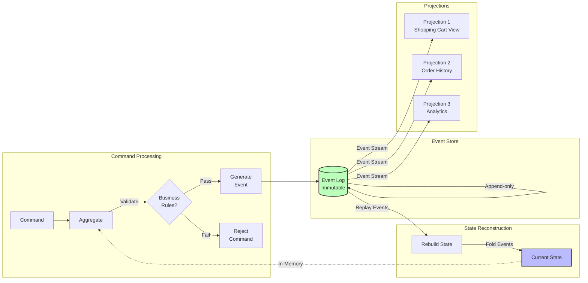
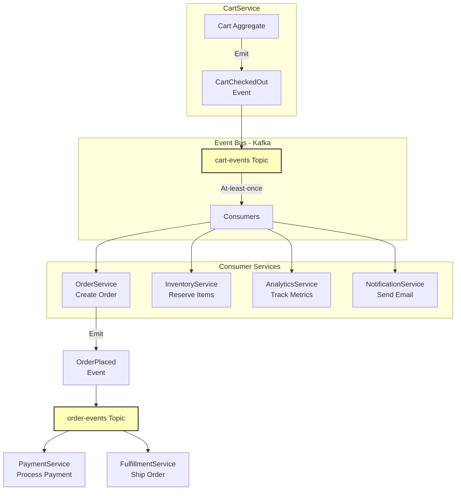
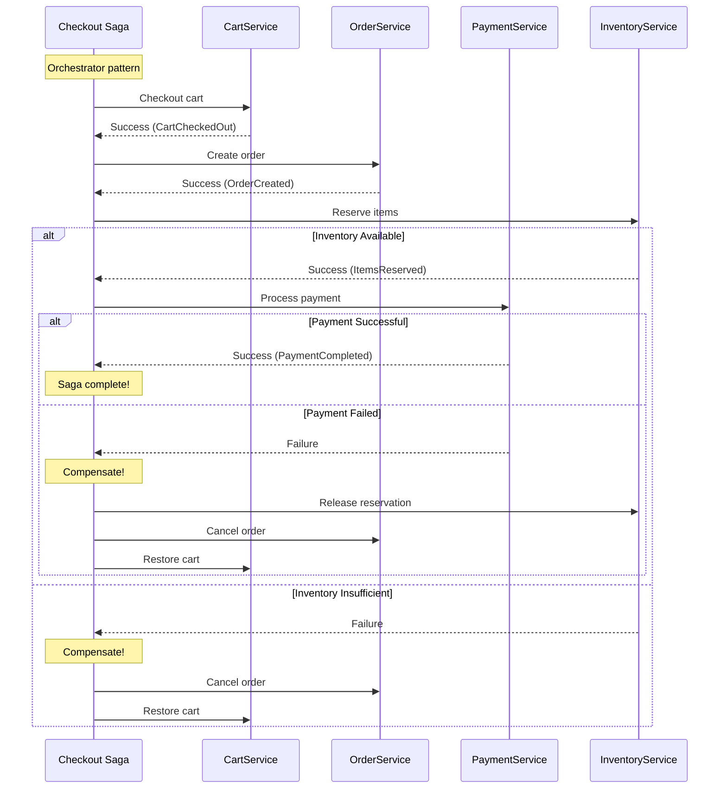

# ADR-0007: CQRS and Event-Driven Architecture Patterns

**Status**: Accepted  
**Date**: 2025-11-26  
**Deciders**: Tony Moores  
**Technical Story**: Phase 0 - Foundation

## Context

TJMPaaS services require architectural patterns that support scalability, maintainability, and the reactive principles established in ADR-0005. The choice of architectural patterns significantly impacts how services handle complexity, state management, and integration.

### Problem Statement

Establish architectural patterns for TJMPaaS services that:
- Support command and query separation for scalability
- Enable event-driven communication and integration
- Align with Reactive Manifesto principles (message-driven)
- Facilitate audit trails and temporal queries
- Enable independent scaling of read and write workloads
- Support eventual consistency where appropriate

### Goals

- Clear separation of write (command) and read (query) concerns
- Event sourcing as foundation for state management
- Event-driven integration between services
- Scalable read models optimized for queries
- Audit trail and temporal query capabilities
- Support for agent/actor patterns (ADR-0006)

### Constraints

- Must integrate with Scala 3 and functional programming
- Must work with agent/actor patterns
- Must support containerization and Kubernetes
- Must be implementable by solo developer initially
- Complexity must be manageable

## Decision

**Adopt CQRS (Command Query Responsibility Segregation) and Event-Driven Architecture as preferred patterns** for TJMPaaS services, with:

1. **CQRS**: Separate command (write) and query (read) models
2. **Event Sourcing**: Store state changes as immutable events
3. **Event-Driven Integration**: Services communicate via events/messages
4. **Eventual Consistency**: Accept eventual consistency where appropriate
5. **Read Model Optimization**: Denormalize read models for query performance

## Rationale

### CQRS Benefits

**Command-Query Separation**:
- **Write Model**: Optimized for business logic and validation
- **Read Model**: Optimized for query performance
- **Independent Scaling**: Scale reads and writes separately
- **Flexibility**: Different data models for different needs

**Why CQRS for TJMPaaS**:
- **Digital Commerce**: High read-to-write ratios (browsing vs purchasing)
- **Performance**: Optimize queries without compromising write integrity
- **Scalability**: Scale read replicas independently
- **Complexity Management**: Clear separation of concerns

### Event Sourcing Benefits

**Immutable Event Log**:
- **Audit Trail**: Every state change recorded permanently
- **Temporal Queries**: Query state at any point in time
- **Event Replay**: Rebuild state from events
- **Debugging**: Complete history for troubleshooting

**Why Event Sourcing for TJMPaaS**:
- **Digital Commerce**: Audit requirements (orders, payments, inventory)
- **Compliance**: Immutable records for regulatory needs
- **Analytics**: Rich event history for business intelligence
- **Recovery**: Rebuild state after failures

### Event-Driven Integration

**Asynchronous Messaging**:
- **Decoupling**: Services don't directly depend on each other
- **Resilience**: Message queues buffer temporary failures
- **Scalability**: Backpressure and flow control
- **Flexibility**: Add new consumers without changing producers

**Aligns with Reactive Manifesto**:
- **Message-Driven**: Core principle (ADR-0005)
- **Resilient**: Failures isolated via async boundaries
- **Elastic**: Scale consumers independently
- **Responsive**: Non-blocking operations

### Integration with Actor Model

**Actors + CQRS**:
- **Command Handlers**: Actors process commands
- **Event Persistence**: Actors emit events
- **Read Models**: Subscribe to event streams
- **Natural Fit**: Actor state = event-sourced aggregate

**Example**:
```scala
// Shopping cart actor with event sourcing
object ShoppingCart {
  sealed trait Command
  case class AddItem(item: Item, replyTo: ActorRef[Response]) extends Command
  
  sealed trait Event
  case class ItemAdded(item: Item) extends Event
  
  def apply(cartId: CartId): EventSourcedBehavior[Command, Event, State] =
    EventSourcedBehavior(
      persistenceId = PersistenceId.ofUniqueId(cartId),
      emptyState = State.empty,
      commandHandler = handleCommand,
      eventHandler = handleEvent
    )
}
```

### Eventual Consistency

**When to Accept**:
- Cross-service data synchronization
- Read model updates
- Non-critical business processes
- Analytics and reporting

**When to Require Strong Consistency**:
- Financial transactions
- Inventory reservations
- Payment processing
- Critical business rules

## Alternatives Considered

### Alternative 1: Traditional CRUD with Shared Database

**Description**: Standard create-read-update-delete with single database

**Pros**:
- Simple to understand
- Immediate consistency
- Straightforward queries
- Familiar patterns

**Cons**:
- Tight coupling via database
- Poor scaling characteristics
- No audit trail
- Hard to optimize reads and writes separately
- Doesn't align with microservices

**Reason for rejection**: Doesn't support reactive principles, poor scalability, insufficient for commerce requirements

### Alternative 2: CQRS Without Event Sourcing

**Description**: Separate command/query models but state stored traditionally

**Pros**:
- Simpler than event sourcing
- Separate read/write scaling
- Familiar state storage

**Cons**:
- No audit trail
- No temporal queries
- Lose event replay capability
- More complex synchronization

**Reason for rejection**: Miss key benefits of event sourcing (audit, replay, temporal queries) critical for commerce

### Alternative 3: Event Sourcing Without CQRS

**Description**: Event sourcing for state but single model for reads/writes

**Pros**:
- Audit trail benefits
- Event replay capability
- Simpler than full CQRS

**Cons**:
- Can't optimize reads separately
- Query performance limitations
- Single model must serve both purposes

**Reason for rejection**: Lose scalability benefits of separate read/write models

### Alternative 4: Synchronous REST-Based Integration

**Description**: Services call each other directly via REST APIs

**Pros**:
- Simple request-response
- Immediate feedback
- Straightforward debugging

**Cons**:
- Tight coupling
- Cascade failures
- Poor resilience
- Doesn't align with reactive principles

**Reason for rejection**: Violates reactive principles, poor resilience, tight coupling

### Alternative 5: No Standardized Pattern

**Description**: Each service chooses its own patterns

**Pros**:
- Maximum flexibility
- Best tool per job

**Cons**:
- Inconsistent architecture
- Knowledge doesn't transfer
- Integration challenges
- Hard to maintain

**Reason for rejection**: Need consistent patterns for maintainability and knowledge transfer

## Consequences

### Positive

- **Scalability**: Independent scaling of reads and writes
- **Performance**: Optimized read models for queries
- **Audit Trail**: Complete history of state changes
- **Flexibility**: Different models for different needs
- **Resilience**: Async boundaries isolate failures
- **Temporal Queries**: Query state at any point in time
- **Event Replay**: Rebuild state or create new projections
- **Integration**: Loose coupling via events
- **Reactive Alignment**: Natural fit with message-driven principle

### Negative

- **Complexity**: More complex than simple CRUD
- **Eventual Consistency**: Must handle async updates
- **Learning Curve**: CQRS/ES concepts require understanding
- **Storage**: Events consume more storage than snapshots
- **Development Time**: More initial setup required

### Neutral

- **Infrastructure**: Need event store and message broker
- **Tooling**: Good libraries available (Akka Persistence, ZIO, etc.)
- **Testing**: Different testing strategies needed

## Implementation

### Requirements

**Event Store**:
- Persistent event log (Akka Persistence, EventStoreDB, Kafka)
- Event ordering guarantees
- Event replay capability
- Snapshotting for performance

**Message Broker**:
- Reliable message delivery (Kafka, RabbitMQ, GCP Pub/Sub)
- Pub/sub patterns
- At-least-once delivery
- Dead letter queues

**Read Model Storage**:
- Optimized for queries (PostgreSQL, MongoDB, Elasticsearch)
- Denormalized projections
- Eventually consistent
- Rebuild capability

**Framework Support**:
- Akka Persistence or Pekko Persistence for event sourcing
- ZIO for effect management
- Cats Effect as alternative
- See PDR-0005 for framework selection guidelines

### CQRS Pattern Architecture

The following diagrams illustrate CQRS implementation patterns in TJMPaaS:

#### CQRS Maturity Levels

```mermaid
graph TB
    subgraph "Level 1 - Simple CQRS"
        L1C[Commands<br/>Separate Methods] --> L1DB[(Single Database<br/>Same Model)]
        L1Q[Queries<br/>Separate Methods] --> L1DB
        L1DB -.->|Same data model| L1DB
    end
    
    subgraph "Level 2 - Standard CQRS ⭐ TJMPaaS Default"
        L2C[Commands<br/>Write Model] --> L2WDB[(Write DB<br/>PostgreSQL)]
        L2WDB -->|Events| L2Proj[Projection]
        L2Proj --> L2RDB[(Read DB<br/>Optimized Views)]
        L2Q[Queries<br/>Read Model] --> L2RDB
    end
    
    subgraph "Level 3 - Full CQRS/ES ⭐ Audit-Critical"
        L3C[Commands<br/>Aggregate] --> L3ES[(Event Store<br/>Immutable Log)]
        L3ES -->|Event Stream| L3Proj[Multiple Projections]
        L3Proj --> L3DB1[(Read DB 1<br/>SQL)]
        L3Proj --> L3DB2[(Read DB 2<br/>NoSQL)]
        L3Proj --> L3DB3[(Search<br/>Elasticsearch)]
        L3Q[Queries<br/>Optimized Models] --> L3DB1
        L3Q --> L3DB2
        L3Q --> L3DB3
    end
    
    style "Level 2 - Standard CQRS ⭐ TJMPaaS Default" fill:#bfb,stroke:#333,stroke-width:3px
    style "Level 3 - Full CQRS/ES ⭐ Audit-Critical" fill:#bbf,stroke:#333,stroke-width:3px
```

#### Command and Query Flow

```mermaid
sequenceDiagram
    participant Client
    participant CmdAPI as Command API
    participant Actor as Aggregate Actor
    participant EventStore as Event Store
    participant Projection
    participant QueryDB as Query DB
    participant QueryAPI as Query API

    Note over Client,QueryAPI: Command Side (Write Path)
    
    Client->>CmdAPI: POST /cart/items<br/>(Add Item)
    CmdAPI->>Actor: AddItem Command
    
    Note over Actor: Validate business rules<br/>Check invariants
    
    Actor->>EventStore: Persist<br/>ItemAdded Event
    EventStore-->>Actor: Event stored
    
    Note over Actor: Apply event<br/>Update in-memory state
    
    Actor-->>CmdAPI: Success
    CmdAPI-->>Client: 202 Accepted

    Note over Client,QueryAPI: Query Side (Read Path)
    
    EventStore-->>Projection: Event stream<br/>ItemAdded
    
    Note over Projection: Transform event<br/>Build read model
    
    Projection->>QueryDB: Update view<br/>Denormalized cart data
    
    Client->>QueryAPI: GET /cart<br/>(Query Cart)
    QueryAPI->>QueryDB: Read view
    QueryDB-->>QueryAPI: Cart data
    QueryAPI-->>Client: 200 OK + Data
    
    Note over Client,QueryAPI: Eventually consistent<br/>Typical lag: < 1 second
```

#### Event Sourcing Pattern



### Event-Driven Integration Architecture

#### Service Integration via Events



#### Saga Pattern (Distributed Transaction)



### CQRS Pattern Implementation

**Command Side**:
```scala
// Command handler in actor
def handleCommand(state: State, cmd: Command): Effect[Event, State] = cmd match {
  case AddItem(item, replyTo) if state.canAddItem(item) =>
    Effect
      .persist(ItemAdded(item))  // Persist event
      .thenReply(replyTo)(_ => Success)
      
  case AddItem(_, replyTo) =>
    Effect.reply(replyTo)(Failure("Cannot add item"))
}
```

**Event Handler**:
```scala
// Pure function: (State, Event) => State
def handleEvent(state: State, event: Event): State = event match {
  case ItemAdded(item) => state.addItem(item)
  case ItemRemoved(itemId) => state.removeItem(itemId)
}
```

**Query Side**:
```scala
// Read model projection
class CartProjection extends EventHandler[CartEvent] {
  def process(event: CartEvent): Future[Unit] = event match {
    case ItemAdded(cartId, item) =>
      // Update denormalized read model
      repository.updateCartView(cartId, item)
  }
}
```

### Event-Driven Integration

**Publishing Events**:
```scala
// Actor publishes events to message broker
def afterEventPersisted(event: Event): Unit = {
  eventBus.publish(
    topic = "cart-events",
    event = event
  )
}
```

**Consuming Events**:
```scala
// Another service consumes events
eventBus.subscribe("cart-events") { event =>
  event match {
    case CartCheckedOut(cartId, items) =>
      // Create order from cart
      orderService.createOrder(cartId, items)
  }
}
```

### Event Sourcing Best Practices

**Event Design**:
- Events are facts (past tense naming: ItemAdded, OrderPlaced)
- Events are immutable
- Events contain all necessary data
- Small, focused events
- Versioned events for evolution

**Aggregate Design**:
- Aggregate = entity + event sourcing
- One actor per aggregate instance
- Consistency boundary = aggregate
- Commands validated before events persisted

**Snapshotting**:
- Periodic snapshots for performance
- Configurable snapshot frequency
- Snapshot + events = current state

**Event Upcasting**:
- Handle event schema evolution
- Transform old events to new schema
- Maintain backward compatibility

### Technology Choices

**Event Sourcing**:
- **Primary**: Akka Persistence or Pekko Persistence (open-source)
- **Storage**: PostgreSQL, Cassandra, or Kafka as journal
- **Alternative**: EventStoreDB, custom implementation

**Message Broker**:
- **Primary**: Apache Kafka (distributed, scalable, event log)
- **Alternative**: RabbitMQ (flexible routing)
- **Cloud**: GCP Pub/Sub (managed service)

**Read Model Storage**:
- **SQL**: PostgreSQL (relational queries)
- **NoSQL**: MongoDB (flexible schema)
- **Search**: Elasticsearch (full-text search)
- Choose based on query patterns

### Guidelines

**When to Use CQRS**:
- High read-to-write ratio
- Complex query requirements
- Need to scale reads independently
- Different consistency requirements for reads/writes

**When to Use Event Sourcing**:
- Audit trail required
- Temporal queries needed
- Need to replay events
- Complex business logic

**When to Use Event-Driven Integration**:
- Services need to stay decoupled
- Async communication acceptable
- Need resilience to downstream failures
- Multiple consumers of same events

**When NOT to Use**:
- Simple CRUD services (overkill)
- Strong consistency required everywhere
- Immediate consistency critical
- Team lacks CQRS/ES experience and time to learn

## Validation

Success criteria:

- Command and query models separated effectively
- Events capture all state changes
- Read models updated from event streams
- Services integrated via events/messages
- Audit trail complete and queryable
- Temporal queries work correctly
- Performance meets requirements
- System remains maintainable

Metrics:
- Command processing time (< 50ms p95)
- Event persistence time (< 20ms p95)
- Read model lag (< 1 second typical)
- Query response time (< 100ms p95)
- Event replay time (< 5 minutes for 1M events)
- Storage growth rate (monitor)

## Risks

| Risk | Severity | Mitigation |
|------|----------|------------|
| Complexity overwhelming | Medium | Start simple; use proven libraries; document patterns; training |
| Eventual consistency issues | Medium | Clear consistency boundaries; compensating transactions; monitoring |
| Event schema evolution | Medium | Event versioning; upcasting; careful event design |
| Storage growth | Low | Snapshotting; archival strategy; compression |
| Performance issues | Low | Proper indexing; caching; snapshotting; monitoring |
| Debugging complexity | Medium | Good logging; event visualization tools; tracing |

## Related Decisions

- [ADR-0005: Reactive Manifesto Alignment](./ADR-0005-reactive-manifesto-alignment.md) - CQRS/ES enables message-driven architecture
- [ADR-0006: Agent-Based Service Patterns](./ADR-0006-agent-patterns.md) - Actors are natural command handlers and aggregates
- [ADR-0004: Scala 3 Technology Stack](./ADR-0004-scala3-technology-stack.md) - Scala 3 excellent for CQRS/ES implementation
- [PDR-0005: Framework Selection Policy](./PDR-0005-framework-selection-policy.md) - Guidelines for choosing CQRS/ES frameworks
- Future ADR: Event schema evolution strategy
- Future ADR: Saga pattern for distributed transactions

## Related Best Practices

This decision is validated by comprehensive industry research:

- **[CQRS Patterns Best Practices](../../best-practices/architecture/cqrs-patterns.md)**: ING Bank achieved 60% infrastructure cost reduction with CQRS; eBay handles 1B+ products with sub-10ms query latency; Capital One reduced query latency by 70% through CQRS. Industry evidence shows 10-100x read throughput improvement and independent scaling of read/write workloads. Maturity model guidance: Level 2-3 recommended for TJMPaaS cart, orders, and product catalog services.

- **[Event-Driven Architecture Best Practices](../../best-practices/architecture/event-driven.md)**: Netflix processes 1 trillion events/day achieving 50-60% cost reduction; Uber handles 100B+ events/day with Kafka; Shopify processes 1M+ events/second during peak sales. Event-driven integration enables service decoupling, 10-100x better scaling, and resilience through async boundaries. Kafka recommended for high-throughput event streaming with saga patterns for distributed transactions.

**Key Validation**: CQRS enables 60% infrastructure cost reduction (ING Bank) and 10-100x read throughput improvements. Event-driven architecture delivers 50-70% cost efficiency at trillion-event-per-day scale (Netflix, Uber). Combined patterns critical for scalable e-commerce systems.

## Related Features

**Features That Validate This Decision**:

*To be documented in Phase 1 (Governance Inference Analysis)*

Expected features demonstrating CQRS/Event-Driven patterns:

**CQRS Maturity Levels**:
- **Level 2 (Standard CQRS)**: Shopping cart, product catalog, user profiles - separate read/write models without event sourcing
- **Level 3 (Full CQRS/ES)**: Orders, payments, inventory - event sourcing for complete audit trail

**Event-Driven Integration**:
- Features publishing domain events (CartCheckedOut, OrderPlaced, PaymentProcessed)
- Features consuming events from other services (inventory updates, order notifications)
- Saga patterns for distributed transactions (checkout, fulfillment)

**Inference Tracking**: See [GOVERNANCE-FEATURE-INFERENCE-MAP.md](../../GOVERNANCE-FEATURE-INFERENCE-MAP.md#adr-0007-cqrs-and-event-driven-architecture)

## References

- [CQRS Pattern - Martin Fowler](https://martinfowler.com/bliki/CQRS.html)
- [Event Sourcing - Martin Fowler](https://martinfowler.com/eaaDev/EventSourcing.html)
- [Akka Persistence](https://doc.akka.io/docs/akka/current/typed/persistence.html)
- [Pekko Persistence](https://pekko.apache.org/docs/pekko/current/typed/persistence.html)
- [Reactive Messaging Patterns](https://www.reactivemanifesto.org/glossary#Message-Driven)
- [Event Sourcing with Actors](https://doc.akka.io/docs/akka/current/typed/persistence.html)
- [CQRS Journey - Microsoft](https://docs.microsoft.com/en-us/previous-versions/msp-n-p/jj554200(v=pandp.10))

## Notes

**CQRS/ES for Digital Commerce**:

Excellent applications in commerce:
1. **Shopping Cart**: Command side validates, event side projects views
2. **Orders**: Complete audit trail, temporal queries (order history)
3. **Inventory**: Events track all movements, projections show availability
4. **Pricing**: Price changes as events, history for analytics
5. **Promotions**: Promotion application events, audit compliance
6. **Payments**: Critical audit trail, dispute resolution
7. **Customer**: Profile changes tracked, GDPR compliance

**Event Types**:

**Domain Events**: Business-significant occurrences
- `OrderPlaced`, `PaymentReceived`, `ItemShipped`
- Published for integration
- Part of ubiquitous language

**Integration Events**: Cross-service communication
- Derived from domain events
- Published to message broker
- Consumed by other services

**Private Events**: Internal to service
- Not published externally
- Implementation detail

**Consistency Boundaries**:

**Strong Consistency** (within aggregate):
- Single actor/aggregate
- ACID within aggregate
- Immediate validation

**Eventual Consistency** (across aggregates):
- Via events and sagas
- Compensating actions
- Business accepts delay

**Actor Model + Event Sourcing**:

Perfect synergy:
- **Actor** = Aggregate root
- **Messages** = Commands
- **Events** = State changes
- **Supervision** = Failure handling
- **Persistence** = Event store

Example actor lifecycle:
1. Receive command
2. Validate against current state
3. Generate events
4. Persist events
5. Apply events to state
6. Acknowledge command
7. Publish events for integration

**Implementation Strategy**:

**Phase 1**: Single service with CQRS/ES
- Shopping cart service
- Prove patterns
- Establish best practices

**Phase 2**: Add event-driven integration
- Cart → Order integration
- Event bus/broker
- Consumer patterns

**Phase 3**: Expand to more services
- Replicate patterns
- Refine approaches
- Build shared libraries

**Simplicity First**:

Start simple:
- Use CQRS only where beneficial
- Event sourcing only where audit trail needed
- Can mix patterns (some services CRUD, some CQRS/ES)
- Complexity budget matters

**CQRS Maturity Model**:

See [CQRS Patterns Best Practices](../../best-practices/architecture/cqrs-patterns.md) for detailed maturity model:

- **Level 1 - Simple CQRS**: Separate methods, same database, same model
  - Use for: Low complexity, learning CQRS concepts
  - TJMPaaS: Rarely needed (either CRUD or full CQRS)

- **Level 2 - Standard CQRS**: Separate models, separate databases, no event sourcing
  - Use for: Shopping cart, product catalog, user profiles
  - TJMPaaS: **Recommended for most services**
  - Benefits: Independent read/write scaling, optimized queries

- **Level 3 - Full CQRS/ES**: Event sourcing, complete audit trail, temporal queries
  - Use for: Orders, payments, inventory (audit-critical)
  - TJMPaaS: Audit-critical domains only
  - Benefits: Complete history, compliance, event replay

**When NOT to use CQRS**:
- Simple CRUD operations (user preferences, configuration)
- Low read/write volume services
- Services without complex query requirements
- Internal admin tools

Document chosen CQRS maturity level in service canvas (see PDR-0006).

## Revision History

| Date | Change | Author |
|------|--------|--------|
| 2025-11-26 | Initial draft and acceptance | Tony Moores |
