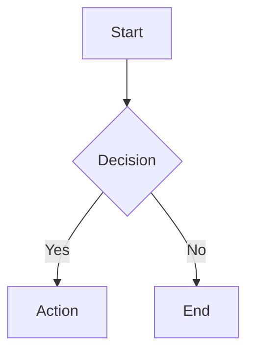
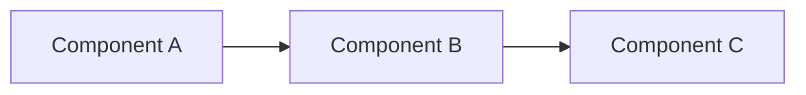
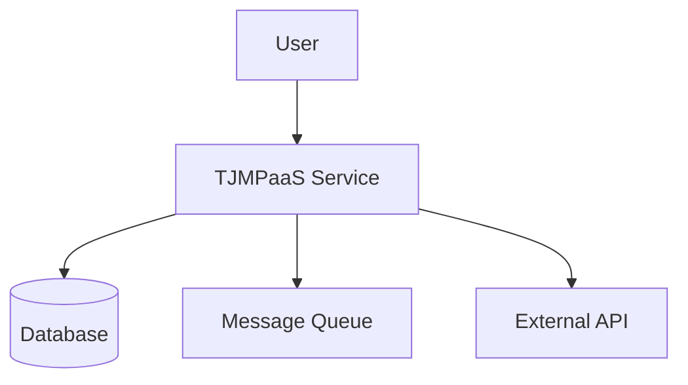
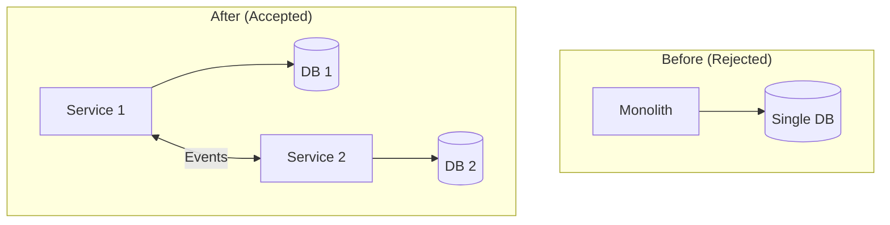
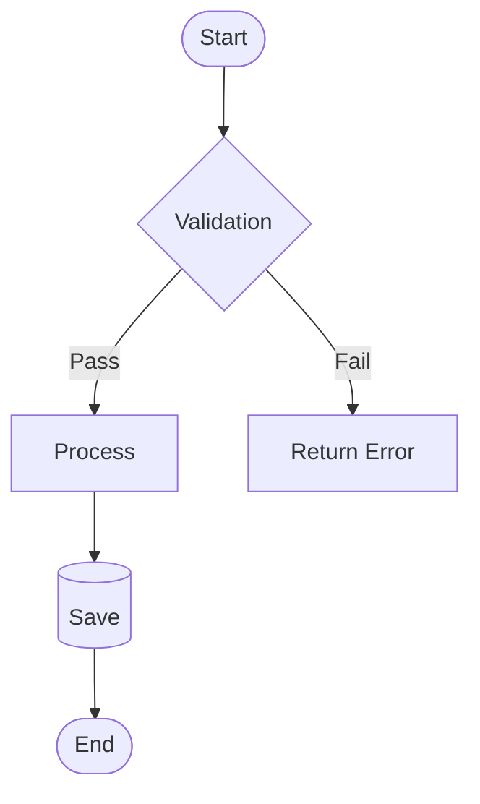
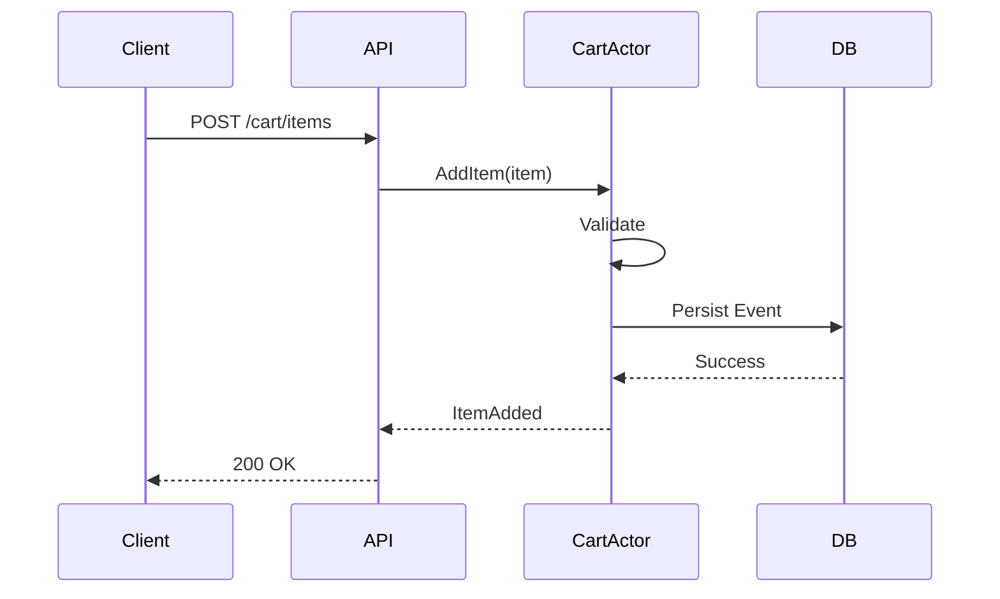
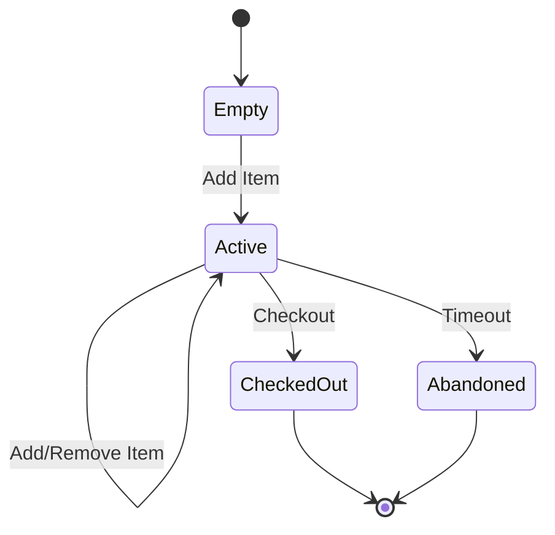
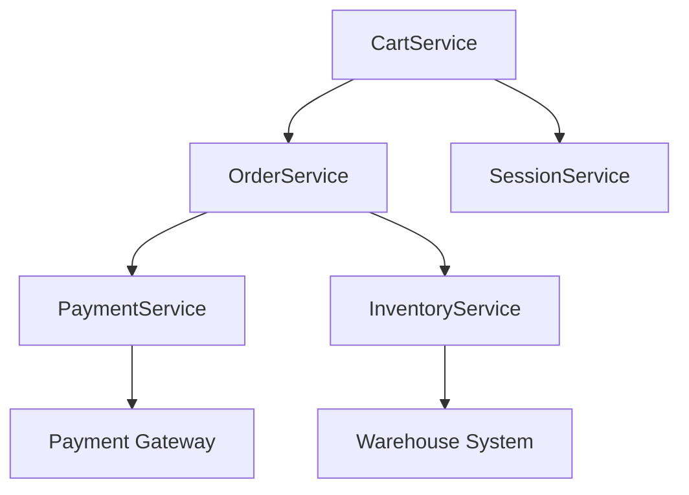
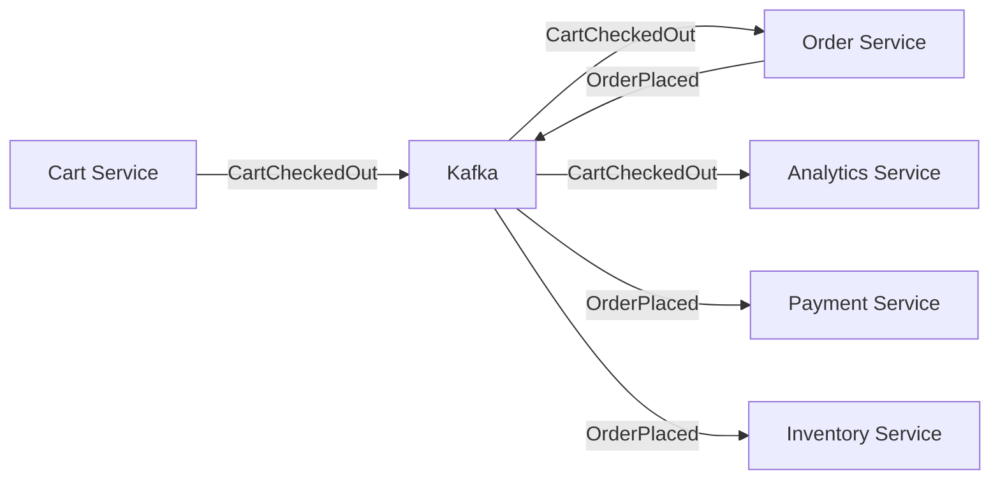
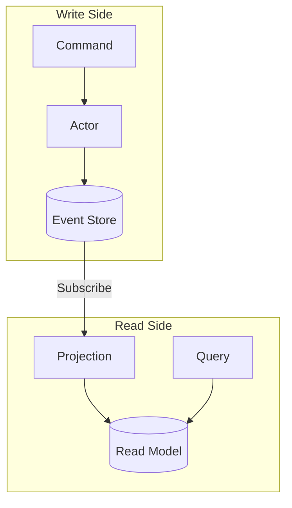

# POL-documentation-diagrams: Documentation Diagram Standards

**Status**: Active  
**Effective Date**: 2025-11-26  
**Review Date**: 2026-11-26  
**Owner**: Tony Moores  
**Category**: Documentation

## Purpose

This policy establishes standards for using diagrams in TJMPaaS documentation to enhance clarity, comprehension, and maintainability. Diagrams provide visual representation of complex concepts, architectures, workflows, and relationships that are difficult to convey through text alone.

## Scope

### Applies To

- All governance documents (ADRs, PDRs, POLs)
- All architectural documentation
- Feature documentation (per PDR-0008)
- Service documentation (canvases, detailed docs)
- Process documentation
- Any documentation where visual representation aids understanding

### Exclusions

- Simple lists or tables (not all content needs diagrams)
- Temporary working documents (diagrams optional)
- External third-party documentation

## Policy Statement

All TJMPaaS documentation that would benefit from visual representation MUST include diagrams using Mermaid syntax embedded in markdown code blocks.

### Mandatory Requirements

#### 1. Diagram Format

**1.1 Mermaid Syntax**
- All diagrams MUST use Mermaid diagram syntax
- Diagrams MUST be embedded in markdown using proper code block delimiters
- Mermaid syntax MUST be validated before committing
- Diagram code MUST be properly indented and formatted

**1.2 Diagram Types**

Approved Mermaid diagram types:
- **Flowchart**: Process flows, decision trees, workflows
- **Sequence Diagram**: API interactions, message flows, actor communications
- **Class Diagram**: Domain models, type hierarchies, relationships
- **State Diagram**: State machines, lifecycle management, transitions
- **Entity Relationship**: Database schemas, data relationships
- **Gantt Chart**: Project timelines, roadmaps, schedules
- **Git Graph**: Branch strategies, release workflows
- **Architecture (C4)**: System context, containers, components

**1.3 Code Block Format**

Standard format:


#### 2. When to Include Diagrams

**2.1 Mandatory Diagram Scenarios**

Diagrams MUST be included for:
- **Architecture decisions** (ADRs): System context, component interactions
- **Process flows** (PDRs): Workflow steps, decision points
- **Feature documentation**: API sequences, actor message flows, state transitions
- **Service relationships**: Dependencies, integration patterns
- **Data flows**: Event streams, CQRS patterns, saga coordination

**2.2 Recommended Diagram Scenarios**

Diagrams SHOULD be included for:
- Complex relationships or hierarchies
- Temporal sequences (before/after comparisons)
- Alternative approaches being compared
- Multi-step processes
- System boundaries and contexts

**2.3 Optional Diagram Scenarios**

Diagrams MAY be included for:
- Simple linear processes (text may suffice)
- Well-understood patterns (link to external reference)
- Highly detailed implementation (code is clearer)

#### 3. Diagram Quality Standards

**3.1 Accuracy**
- Diagrams MUST accurately reflect documented concepts
- Labels MUST match terminology used in text
- Relationships MUST be correct and complete
- Diagrams MUST be updated when concepts change

**3.2 Clarity**
- Diagrams MUST be readable and understandable
- Font sizes MUST be legible (Mermaid default styling acceptable)
- Color usage SHOULD be meaningful (if used)
- Complexity SHOULD be managed (break large diagrams into multiple)

**3.3 Consistency**
- Similar concepts SHOULD use similar diagram types
- Terminology SHOULD be consistent across diagrams
- Styling SHOULD be consistent (Mermaid defaults preferred)
- Diagram placement SHOULD be near related text

**3.4 Maintainability**
- Diagrams MUST be version-controlled with documentation
- Mermaid syntax MUST be human-readable and editable
- Comments SHOULD explain non-obvious diagram elements
- Diagrams SHOULD be simple enough to maintain easily

#### 4. Diagram Content Guidelines

**4.1 Elements and Labels**
- Labels MUST be derived from actual documentation
- Labels MUST use project terminology (from ubiquitous language)
- Acronyms MUST be defined in diagram or nearby text
- Labels SHOULD be concise but descriptive

**4.2 Alignment with Text**
- Diagrams MUST align with and reinforce documented topics
- Text SHOULD reference diagrams explicitly
- Diagrams SHOULD be placed near first reference
- Complex diagrams MAY be referenced from multiple sections

**4.3 Level of Detail**
- Diagrams SHOULD match documentation abstraction level
- High-level docs → high-level diagrams (system context)
- Detailed docs → detailed diagrams (component interactions)
- Avoid mixing abstraction levels in single diagram

## Implementation Guidelines

### Mermaid Code Block Format

All diagrams use standard markdown code block with `mermaid` language identifier:

````markdown

````

### Common Diagram Patterns

#### Architecture Decision (ADR)

**Context Diagram**:


**Before/After Comparison**:


#### Process Flow (PDR)

**Workflow Diagram**:


#### Feature Documentation

**Sequence Diagram** (Actor Message Flow):


**State Diagram** (Entity Lifecycle):


#### Service Relationships

**Dependency Graph**:


#### Data Flow

**Event-Driven Architecture**:


**CQRS Pattern**:


### Validation Process

Before committing diagrams:

1. **Syntax Check**: Verify Mermaid syntax is valid
   - Use Mermaid live editor: https://mermaid.live/
   - Or install Mermaid CLI locally
   - VS Code with Mermaid extension shows preview

2. **Content Review**:
   - Labels match documentation terminology
   - Relationships are accurate
   - Diagram reinforces documented concept
   - Appropriate level of detail

3. **Placement**:
   - Diagram near first reference in text
   - Diagram section has context (title, description)
   - Text references diagram explicitly

4. **Commit**:
   - Include diagram changes in git commit
   - Commit message mentions diagram additions/updates

## Benefits

### Enhanced Comprehension
- Visual learners benefit from diagrams
- Complex relationships easier to understand
- Patterns become immediately recognizable
- Onboarding time reduced

### Improved Communication
- Diagrams transcend language barriers (somewhat)
- Common visual vocabulary
- Discussion reference points
- Design collaboration enabled

### Better Documentation Quality
- Forces clear thinking about relationships
- Identifies gaps or inconsistencies
- Makes implicit knowledge explicit
- Supports multiple learning styles

### Maintainability
- Text-based Mermaid syntax version-controlled
- No binary image files to manage
- Diagrams update with documentation
- Searchable diagram content

## Enforcement

### Code Review
- Pull requests SHOULD be reviewed for diagram opportunities
- Missing diagrams in complex docs SHOULD be flagged
- Diagram quality SHOULD be assessed

### Documentation Standards Checklist

When creating/updating documentation:
- [ ] Would a diagram improve understanding?
- [ ] Is Mermaid syntax valid?
- [ ] Do labels match documentation terminology?
- [ ] Is diagram placed near relevant text?
- [ ] Is diagram referenced in text?
- [ ] Is diagram at appropriate abstraction level?

## Examples in TJMPaaS

### Existing Documents to Enhance

High-priority candidates for diagram additions:
- **ADR-0005** (Reactive Manifesto): System interaction diagram
- **ADR-0006** (Actor Patterns): Actor hierarchy, message flow
- **ADR-0007** (CQRS): CQRS pattern diagram, event flow
- **PDR-0004** (Repository Organization): Repository structure
- **PDR-0008** (Feature Documentation): Feature workflow
- **GOVERNANCE-FEATURE-INFERENCE-MAP.md**: Bidirectional inference flow

### Template Updates

Templates that SHOULD include diagram examples:
- **FEATURE-TEMPLATE.md**: Sequence diagram section
- **SERVICE-CANVAS.md**: Architecture section
- **ADR-TEMPLATE.md**: Context/decision diagram section

## Related Policies

- [PDR-0001: Documentation Standards](../PDRs/PDR-0001-documentation-standards.md) - Overall documentation structure
- [PDR-0008: Feature Documentation Standard](../PDRs/PDR-0008-feature-documentation-standard.md) - Feature docs require sequence diagrams

## References

- [Mermaid Documentation](https://mermaid.js.org/)
- [Mermaid Live Editor](https://mermaid.live/)
- [C4 Model](https://c4model.com/) - Architecture diagram levels
- [UML Sequence Diagrams](https://en.wikipedia.org/wiki/Sequence_diagram)

## Notes

### Why Mermaid?

**Advantages**:
- Text-based (version control friendly)
- Embedded in markdown (no external tools required)
- Wide GitHub/GitLab support (renders automatically)
- Active development and community
- Multiple diagram types supported
- No binary files to manage

**Alternatives Considered**:
- PlantUML (more complex syntax, less GitHub integration)
- Draw.io (binary XML files, not text-based)
- Lucidchart (proprietary, not embeddable)
- ASCII diagrams (limited expressiveness)

### Mermaid Limitations

**Known constraints**:
- Rendering can vary slightly between viewers
- Complex diagrams may need to be broken up
- Styling options somewhat limited
- Not all UML features supported

**Mitigations**:
- Use common Mermaid features (broad compatibility)
- Break complex diagrams into multiple simpler ones
- Accept default styling (works everywhere)
- Focus on clarity over perfection

### Diagram Anti-Patterns

**Avoid**:
- ❌ Diagrams that duplicate text exactly (no added value)
- ❌ Overly complex diagrams (hard to maintain, hard to understand)
- ❌ Diagrams without context (explain what diagram shows)
- ❌ Stale diagrams (outdated after doc changes)
- ❌ Inconsistent terminology (labels differ from text)

**Prefer**:
- ✅ Diagrams that clarify relationships
- ✅ Simple, focused diagrams
- ✅ Diagrams with clear titles/descriptions
- ✅ Up-to-date diagrams maintained with docs
- ✅ Consistent terminology throughout

## Revision History

| Date | Change | Author |
|------|--------|--------|
| 2025-11-26 | Initial policy creation | Tony Moores |
