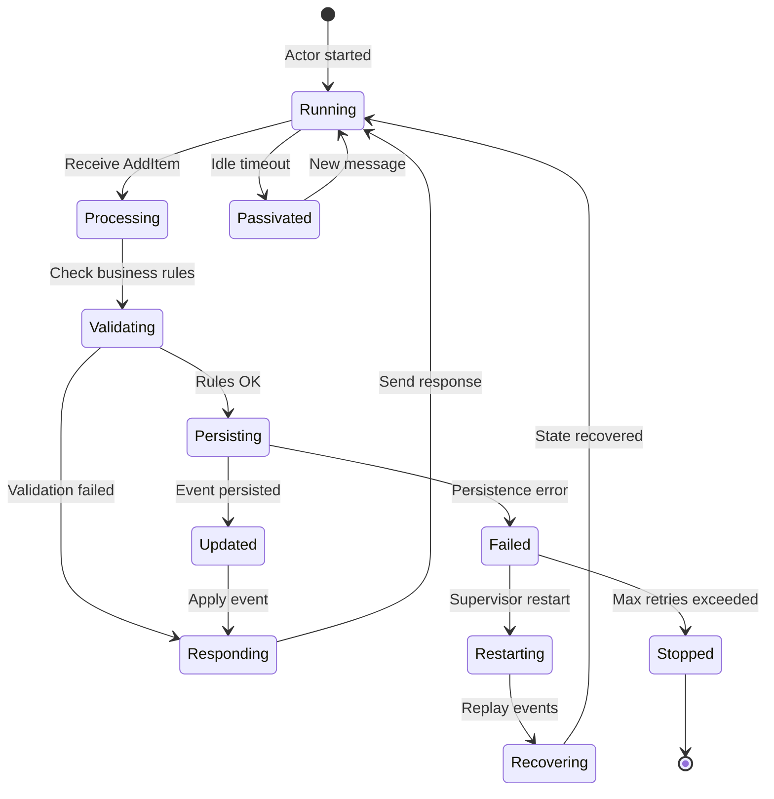

# [Feature Name]

---
**Status**: Active Template  
**Authority**: TJMPaaS Official  
**Last Updated**: 2025-11-26  
**Governance**: [PDR-0008: Feature Documentation Standard](../PDRs/PDR-0008-feature-documentation-standard.md)  
---

**Feature Status**: 🔴 Planned / 🟡 Partial / 🟢 Implemented  
**Priority**: P0 (Foundational) / P1 (Core) / P2 (Enhanced) / P3 (Future)  
**GitHub Issue**: #XXX  
**Last Updated**: YYYY-MM-DD  
**Implementation Effort**: X days (estimated) / X days (actual)

---

## Overview

**Brief Description** (2-3 sentences):

[What this feature does, why it exists, and how it fits into the service]

**User Story**:
```
As a [role]
I want [capability]
So that [benefit]
```

---

## Value Propositions

### Digital Commerce Value

**Business Impact** (~150 words):

[How does this feature enable digital commerce? What business problems does it solve? What revenue/efficiency/quality impacts? Quantify if possible (e.g., "reduces cart abandonment by X%", "processes Y orders/second")]

**Example**: 
- "Shopping cart persistence enables customers to resume purchases across sessions, reducing abandonment by 30%"
- "Real-time inventory validation prevents overselling, reducing fulfillment errors by 95%"

### Customer Value

**End-User Benefits** (~150 words):

[What does the customer experience? How does this make their life better? What pain points does it solve? What delighters does it provide?]

**Example**:
- "Customers can save items for later without losing their selection, reducing anxiety and decision fatigue"
- "Instant feedback on product availability prevents disappointment at checkout"

### Operator Value

**Admin/Operations Benefits** (~150 words):

[How does this help operators/admins manage the platform? What manual work does it eliminate? What visibility/control does it provide? What operational efficiencies?]

**Example**:
- "Automated cart expiration reduces storage costs by 40% while maintaining customer experience"
- "Cart analytics dashboard shows abandonment patterns, enabling targeted interventions"

---

## Applicable Governance

### ADRs (Architectural Decisions)

List relevant ADRs with brief explanation of how they apply:

- **[ADR-0004: Scala 3 Technology Stack](link)** - Uses functional programming patterns (immutability, pure functions)
- **[ADR-0005: Reactive Manifesto Alignment](link)** - Non-blocking operations, responsive under load
- **[ADR-0006: Agent-Based Service Patterns](link)** - Feature uses XYZ actor for state management
- **[ADR-0007: CQRS and Event-Driven Architecture](link)** - Command/Query separation, events published

### PDRs (Process Decisions)

- **[PDR-0006: Service Canvas Documentation Standard](link)** - Feature documented in SERVICE-CANVAS.md
- **[PDR-0008: Feature Documentation Standard](link)** - This standard

### POLs (Policies)

- **[POL-security-baseline](link)** - Authentication/authorization requirements
- **[POL-data-privacy](link)** - PII handling, GDPR compliance

---

## Service Boundaries

### What This Service Owns

**Responsibilities** managed by this service:

- [Specific capability 1]
- [Specific capability 2]
- [State management, business logic, validation]

**Example**:
- Shopping cart state (items, quantities, pricing)
- Cart session management and expiration
- Cart-level validation (minimum order, item limits)

### What We Delegate to Other Services/Platforms

**External Dependencies**:

- **[Other Service]**: [What we depend on]
- **[Platform/External System]**: [What we integrate with]

**Example**:
- **Product Catalog Service**: Product details, pricing, availability
- **Inventory Service**: Real-time stock levels
- **Customer Service**: Customer authentication and profiles

---

## CQRS Maturity Level

**Level**: [1 - Simple CQRS / 2 - Standard CQRS / 3 - Full CQRS+ES / N/A]

**Rationale**: [Why this level? Reference ADR-0007 maturity model]

**If Level 2 or 3**:
- **Commands**: [List command operations - writes]
- **Queries**: [List query operations - reads]
- **Events** (Level 3): [List events published to event store]

**Example (Level 2)**:
- **Commands**: AddItem, RemoveItem, UpdateQuantity, ClearCart
- **Queries**: GetCart, ListCartItems, GetCartSummary

---

## Actor Model Integration

**If this feature uses actors** (per ADR-0006):

### Actors/Agents

| Actor Name | Purpose | Lifecycle | Supervision |
|------------|---------|-----------|-------------|
| [ActorName] | [What it does] | [Per-request/Long-lived/Singleton] | [Strategy] |

**Example**:
| Actor Name | Purpose | Lifecycle | Supervision |
|------------|---------|-----------|-------------|
| ShoppingCartActor | Manages cart state and operations | Long-lived (per cart ID) | RestartOnFailure |

### Message Protocols

**Commands** (messages actor receives):
```scala
sealed trait CartCommand
case class AddItem(productId: String, quantity: Int, replyTo: ActorRef[CartResponse]) extends CartCommand
case class RemoveItem(itemId: String, replyTo: ActorRef[CartResponse]) extends CartCommand
case class GetCart(replyTo: ActorRef[CartResponse]) extends CartCommand
```

**Responses** (messages actor sends):
```scala
sealed trait CartResponse
case class CartUpdated(cart: Cart) extends CartResponse
case class CartNotFound(cartId: String) extends CartResponse
case class InvalidOperation(reason: String) extends CartResponse
```

**Events** (if event-sourced):
```scala
sealed trait CartEvent
case class ItemAdded(itemId: String, productId: String, quantity: Int) extends CartEvent
case class ItemRemoved(itemId: String) extends CartEvent
```

---

## Implementation Status

### Endpoints / APIs

| Method | Endpoint | Purpose | Status | Notes |
|--------|----------|---------|--------|-------|
| POST | `/api/v1/carts/{cartId}/items` | Add item to cart | ✅ Works / 🟡 Partial / ❌ Missing | [Notes] |
| GET | `/api/v1/carts/{cartId}` | Retrieve cart | ✅ Works / 🟡 Partial / ❌ Missing | [Notes] |
| DELETE | `/api/v1/carts/{cartId}/items/{itemId}` | Remove item | ✅ Works / 🟡 Partial / ❌ Missing | [Notes] |

**Status Key**:
- ✅ **Works**: Fully implemented and tested
- 🟡 **Partial**: Partially implemented, gaps documented
- ❌ **Missing**: Not yet implemented

**HATEOAS Compliance**: [Yes/No/Partial] - [Notes on hypermedia links]

### Actors/Components

| Component | Type | Status | Location |
|-----------|------|--------|----------|
| [ComponentName] | Actor/Route/Service/Repository | ✅/🟡/❌ | [File path, lines] |

**Example**:
| Component | Type | Status | Location |
|-----------|------|--------|----------|
| ShoppingCartActor | Actor | ✅ Works | `src/main/scala/cart/actors/ShoppingCartActor.scala:15-200` |
| CartRoutes | HTTP Routes | 🟡 Partial | `src/main/scala/cart/http/CartRoutes.scala:30-150` |

### Events Published

| Event | Topic/Stream | When | Status | Consumers |
|-------|-------------|------|--------|-----------|
| [EventName] | [Kafka topic] | [Trigger] | ✅/🟡/❌ | [Who consumes] |

**Example**:
| Event | Topic/Stream | When | Status | Consumers |
|-------|-------------|------|--------|-----------|
| CartItemAdded | cart-events | Item added successfully | ✅ Works | Analytics, Recommendations |

### Database Tables

| Table | Purpose | Status | Schema Version |
|-------|---------|--------|----------------|
| [table_name] | [What it stores] | ✅/🟡/❌ | [Version] |

---

## Gap Analysis

### What Exists

✅ **Implemented Capabilities**:
- [List what's working]
- [Be specific: endpoints, features, edge cases]

**Example**:
- ✅ Complete CRUD operations for cart items
- ✅ Cart persistence to PostgreSQL
- ✅ Real-time inventory validation
- ✅ HATEOAS links in responses

### Critical Gaps

❌ **Missing Capabilities** (Priority Order):

1. **[Gap Name]** - [Severity: Critical/High/Medium/Low]
   - **Description**: [What's missing]
   - **Why This Matters**: [Impact on users/business]
   - **Proposed Solution**: [How to fix]
   - **Effort**: [X days]

**Example**:
1. **Cart Abandonment Notifications** - Severity: High
   - **Description**: No automated notification when cart inactive for 24+ hours
   - **Why This Matters**: Lose 30% of potential conversions; competitors send reminders
   - **Proposed Solution**: Event-driven scheduler + email service integration
   - **Effort**: 2 days

2. **Bulk Item Operations** - Severity: Medium
   - **Description**: Can only add/remove one item at a time
   - **Why This Matters**: Poor UX for "add all recommendations", slow for bulk operations
   - **Proposed Solution**: AddItems(List[Item]) command, batch validation
   - **Effort**: 1 day

### Impact Summary

**Total Implementation**: [X%] complete  
**Critical Gaps**: [X] items  
**Total Effort to Complete**: [X] days

---

## Architecture

### Sequence Diagrams

#### Happy Path Flow

```mermaid
sequenceDiagram
    participant Customer
    participant API as CartService API
    participant Actor as CartActor
    participant Inventory as InventoryService
    participant DB as Event Store
    participant Queue as Kafka

    Customer->>API: POST /carts/{id}/items
    Note over API: Extract auth token<br/>Validate request
    API->>Actor: AddItem(productId, qty, replyTo)
    
    Actor->>Inventory: CheckAvailability(productId, qty)
    Inventory-->>Actor: Available(qty=5)
    
    Note over Actor: Validate business rules<br/>Calculate totals
    
    Actor->>DB: Persist(ItemAdded event)
    DB-->>Actor: Event persisted
    
    Note over Actor: Apply event to state<br/>Update cart total
    
    Actor->>Queue: Publish(ItemAddedToCart)
    Actor-->>API: ItemAdded(itemId, cartTotal)
    
    API-->>Customer: 201 Created<br/>Location: /items/{itemId}<br/>HATEOAS links
```

#### Error Handling Flow

```mermaid
sequenceDiagram
    participant Customer
    participant API as CartService API
    participant Actor as CartActor
    participant Inventory as InventoryService
    participant CB as Circuit Breaker

    Customer->>API: POST /carts/{id}/items
    API->>Actor: AddItem(productId, qty, replyTo)
    
    Actor->>CB: Check circuit state
    CB-->>Actor: CLOSED (OK to call)
    
    Actor->>Inventory: CheckAvailability(productId, qty)
    
    alt Inventory Available
        Inventory-->>Actor: Available(qty)
        Note over Actor: Proceed with add
    else Insufficient Inventory
        Inventory-->>Actor: InsufficientStock(available=1)
        Actor-->>API: ItemNotAdded(reason)
        API-->>Customer: 400 Bad Request<br/>Error: INSUFFICIENT_INVENTORY
    else Inventory Timeout
        Note over Inventory: No response<br/>Network issue
        Actor-->>CB: Record failure
        CB-->>Actor: Circuit OPEN
        Actor-->>API: ServiceUnavailable
        API-->>Customer: 503 Service Unavailable<br/>Retry-After: 30s
    else Circuit Open
        CB-->>Actor: Circuit OPEN
        Actor-->>API: ServiceUnavailable
        API-->>Customer: 503 Service Unavailable<br/>Degraded mode
    end
```

#### Event Publishing Flow

```mermaid
sequenceDiagram
    participant Actor as CartActor
    participant ES as Event Store
    participant Kafka
    participant Order as OrderService
    participant Analytics

    Note over Actor: State change occurs<br/>(item added, checkout, etc.)
    
    Actor->>ES: Persist(DomainEvent)
    ES-->>Actor: Persisted (offset: 123)
    
    Note over Actor: Event persisted<br/>State updated
    
    Actor->>Kafka: Publish(IntegrationEvent)<br/>Topic: cart-events
    
    Note over Kafka: Durable message queue<br/>At-least-once delivery
    
    Kafka-->>Order: Consume(CartCheckedOut)
    Note over Order: Create order from cart
    
    Kafka-->>Analytics: Consume(ItemAddedToCart)
    Note over Analytics: Update metrics dashboard
    
    Actor-->>Actor: Continue processing<br/>(non-blocking publish)
```

#### Actor Supervision Flow



**Additional Diagrams**:
- Error handling flows
- Event publishing flows
- Cross-service interactions

---

## API Examples

### Request Examples

**Add Item to Cart**:
```bash
curl -X POST https://api.example.com/v1/carts/cart-123/items \
  -H "Authorization: Bearer {token}" \
  -H "Content-Type: application/json" \
  -d '{
    "productId": "prod-456",
    "quantity": 2
  }'
```

**Response** (201 Created):
```json
{
  "itemId": "item-789",
  "productId": "prod-456",
  "quantity": 2,
  "price": {
    "amount": 29.99,
    "currency": "USD"
  },
  "_links": {
    "self": { "href": "/v1/carts/cart-123/items/item-789" },
    "cart": { "href": "/v1/carts/cart-123" },
    "product": { "href": "/v1/products/prod-456" },
    "remove": { "href": "/v1/carts/cart-123/items/item-789", "method": "DELETE" }
  }
}
```

**Error Response** (400 Bad Request):
```json
{
  "error": "INSUFFICIENT_INVENTORY",
  "message": "Product prod-456 has only 1 unit available",
  "available": 1,
  "requested": 2,
  "_links": {
    "cart": { "href": "/v1/carts/cart-123" },
    "product": { "href": "/v1/products/prod-456" }
  }
}
```

---

## Implementation Location

**Code References** (specific files and line numbers):

- **Actor Implementation**: `src/main/scala/cart/actors/ShoppingCartActor.scala:15-200`
- **HTTP Routes**: `src/main/scala/cart/http/CartRoutes.scala:30-150`
- **Domain Model**: `src/main/scala/cart/domain/Cart.scala:10-80`
- **Repository**: `src/main/scala/cart/repository/CartRepository.scala:20-120`
- **Events**: `src/main/scala/cart/events/CartEvents.scala:5-40`

**Database Schema**:
- **Tables**: `db/migrations/V001__create_carts.sql`
- **Indexes**: `db/migrations/V002__cart_indexes.sql`

**Configuration**:
- **Application Config**: `src/main/resources/application.conf:45-60`
- **Actor Config**: `src/main/resources/akka.conf:10-25`

---

## Testing Strategy

### BDD Scenarios

**Location**: `features/[feature-name].feature`

**Gherkin File**: Defines behavioral scenarios (Given/When/Then)

**Coverage**:
- [X] scenarios documented
- [Y] scenarios implemented
- [Z] scenarios passing

### Unit Tests

**Actor Tests**:
- `src/test/scala/cart/actors/ShoppingCartActorSpec.scala`
- Tests message protocols, state transitions, supervision

**Domain Tests**:
- `src/test/scala/cart/domain/CartSpec.scala`
- Tests business logic, validation rules

### Integration Tests

**API Tests**:
- `src/test/scala/cart/http/CartRoutesSpec.scala`
- Tests HTTP endpoints, error handling, HATEOAS

**Event Tests**:
- `src/test/scala/cart/events/CartEventsSpec.scala`
- Tests event publishing, schema, consumers

### Test Coverage

**Target**: ≥80% line coverage, ≥90% branch coverage  
**Current**: [X]% line, [Y]% branch  
**Gaps**: [List untested scenarios]

---

## Non-Functional Requirements

### Performance

- **Response Time**: < 200ms p95 for reads, < 500ms p95 for writes
- **Throughput**: [X] requests/second sustained
- **Concurrency**: [Y] simultaneous carts
- **Resource Limits**: [Memory/CPU constraints]

**Current Performance**: [Actual measurements if implemented]

### Reliability

- **Availability**: 99.9% uptime target
- **Error Rate**: < 0.1% under normal load
- **Recovery Time**: < 60 seconds after failure
- **Data Durability**: Zero data loss on actor restart

### Scalability

- **Horizontal Scaling**: Add instances as needed
- **State Management**: Actor sharding for distribution
- **Database**: Read replicas for queries
- **Caching**: [Strategy if applicable]

### Security

- **Authentication**: Required (JWT tokens)
- **Authorization**: Cart ownership validation
- **Data Protection**: [Encryption at rest/in transit]
- **Audit Trail**: All modifications logged

---

## Observability

### Health Checks

- **Liveness**: `/health` - Actor system responsive
- **Readiness**: `/ready` - Database connected, dependencies available

### Metrics (Prometheus)

- `cart_operations_total{operation, status}` - Operation counts
- `cart_operation_duration_seconds{operation}` - Operation latency
- `cart_active_count` - Number of active carts
- `cart_items_per_cart` - Items per cart histogram

### Logging

- **Info**: Cart created, item added/removed, checkout initiated
- **Warn**: Validation failures, inventory issues
- **Error**: Database failures, actor crashes, timeouts

**Log Format**: JSON structured logging with correlation IDs

### Tracing

- **Distributed Tracing**: Jaeger/Zipkin integration
- **Trace Operations**: Add item, checkout flow, cross-service calls

---

## Related Features

### Dependencies (Required First)

- [Prerequisite Feature 1] - Why needed
- [Prerequisite Feature 2] - Why needed

### Related Features (Same Service)

- [Related Feature 1] - Relationship
- [Related Feature 2] - Relationship

### Cross-Service Features

- [Other Service Feature] - Integration point

**Example**:
- **Dependencies**: Customer authentication (required for cart ownership)
- **Related**: Cart checkout (uses this feature's cart retrieval)
- **Cross-Service**: Order creation (consumes cart data on checkout)

---

## Future Considerations

### Enhancements (Post-MVP)

- [Enhancement 1] - [Benefit and effort]
- [Enhancement 2] - [Benefit and effort]

**Example**:
- Guest cart merge on login (2 days) - Improves conversion for guest→registered users
- Cart sharing (3 days) - Enable collaborative shopping (wishlists, gift registries)

### Technical Debt

- [Known limitation 1] - [Plan to address]
- [Known limitation 2] - [Plan to address]

### Scalability Concerns

- [What might not scale] - [Mitigation strategy]

---

## Changelog

| Date | Change | Author |
|------|--------|--------|
| YYYY-MM-DD | Initial feature documentation | [Name] |
| YYYY-MM-DD | Implementation complete | [Name] |
| YYYY-MM-DD | Gap X closed | [Name] |

---

## Notes

**Additional Context**:
[Any additional notes, decisions, or context that doesn't fit above sections]

**References**:
- [Link to related documents]
- [Link to external resources]
- [Link to research/benchmarks]

---

**Template Version**: 1.0  
**Last Template Update**: 2025-11-26  
**Maintained By**: TJMPaaS Governance
